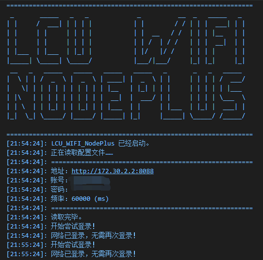

# （聊城大学）校园网(LCU-WIFI)登录 Node.js 版
# LCU_WIFI_NODEPLUS
- 此脚本原理为定时获取登录状态与尝试登录，请根据自身需求合理修改参数
- 此脚本仅供学习交流使用
- 此脚本理论上可用于所有锐捷认证（ePortal）的校园网络，但是会出现不同学校间加密方式、系统版本的差异，欢迎贡献、修改代码，增加支持学校。

## 目前支持的学校

  - [x] 聊城大学 
  - [ ] 你的大学
  - [ ] ……………… 

## 使用方法
1. clone this repo or download zip.
2. 安装 [node.js](https://www.cnblogs.com/aizai846/p/11441693.html).
   更换淘宝镜像:
   ```
   npm config set registry http://registry.npm.taobao.org
   ```
3. ```
   cd NODE_PLUS
   npm install
   ```
4. 修改配置文件setting.json:
   （若为聊城大学第一个地址无需修改。）
   ```
   {
       "EportalURL":"http://172.30.2.2:8088",
       "UserID":"学号",
       "Password":"密码",
       "Time":"频率（毫秒）"
   }
   ```
5. `node index.js`


## 预览
  
