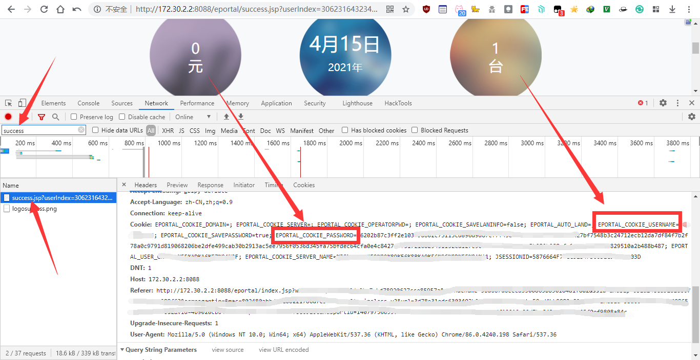

# 聊城大学校园网(LCU-WIFI)登录 - Shell脚本版

- 此脚本仅供学习交流使用
- 此脚本分为不加密版和加密版（需要手动找加密后的密码）
##  一、不加密版（安全性低）

> 此方法由另一位好兄弟发现，即 encryptipassword=false

用法：

```bash
# 下载脚本
wget --no-check-certificate https://raw.githubusercontent.com/rentianyu/LCU_WIFI/master/SHELL/login_unsafe.sh
# 运行登录（密码中一些特殊符号，比如&、#不支持）
sh login_unsafe.sh 账号 密码
```

## 二、加密版（需要手动找加密后的密码）

- 因校园网密码加密算法时常改变和个人能力有限，密码需要在浏览器里自己找一下
- 用法为
  1. 在 [登录](http://172.30.2.2:8088) 前按F12抓包，登录成功后找`http://172.30.2.2:8088/eportal/success.jsp?userIndex****`的Cookie
  2. 下载脚本 [login](./login.sh) ，将所需值填入脚本内对应位置后运行脚本即可

```bash
# Cookie内EPORTAL_COOKIE_USERNAME值，即 学号，为10位
userId=2020*****9
# Cookie内EPORTAL_COOKIE_PASSWORD的值，即 新版密码加密后的值，为256位
password=66202****488b487
```



